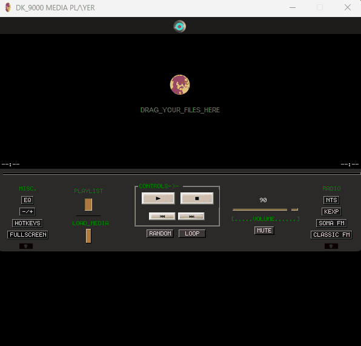

# DK_9000 �
A retro-inspired media player built with Python/Tkinter, born from the idea of DJ software and expanded through cinema.



DK_9000 started as a simple audio project and evolved into a creative tool with playlists, radio streams, video playback, and compact UI modes.  
This is my first project developed with Copilot assistance, helping me push the code further than a basic tutorial.

---

## Motivation
DK_9000 began as a simple media player — the foundation for any DJ software since it handles audio.  
Later, I decided to introduce video support, which was a real challenge, but as a cinema lover it became one of the most rewarding parts of the project.

---

## Learning Journey
I have been studying Python for about 3 years, with ups and downs.  
Courses such as *Píldoras Informáticas* by Juan Díaz and Cristian Koch’s Pygame course on Udemy gave me the foundation to build DK_9000 without losing control of the project.

---

## Features
- Audio and video playback with automatic detection  
- Playlist management with duplicate control  
- Five-band equalizer, expandable with a dedicated button  
- Floating overlay with playback controls  
- Visual feedback: time indicators shift from grey to green during playback  
- Random and loop modes for flexible listening  
- Fullscreen mode for video  
- Compact mode: +/- button hides the listbox or video frame  
- Hotkeys for quick control (e.g. Left: skip back, M: mute)  
- Help button showing all key bindings  

---

## Radio Stations
DK_9000 includes four curated radio streams, reflecting different moods and influences:  
- NTS: electronic and experimental  
- KEXP: indie rock and alternative  
- SomaFM: jazzy and eclectic  
- Classic FM: timeless classical repertoire  

---

## Compatibility

Currently available for **Windows** only.  
Support for other platforms may be added in future versions.

## License

This project is licensed under the MIT License - see the [LICENSE](LICENSE) file for details.

---

## Installation
Clone the repository and run the main script:
```bash
git clone https://github.com/yourusername/DK_9000.git
cd DK_9000
python main.py

