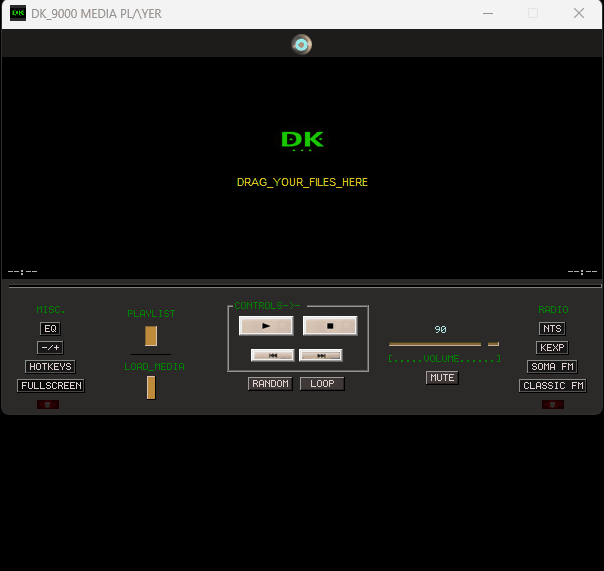

DK_9000 – Retro Media Player (Python / Tkinter)

DK_9000 is a retro-inspired desktop media player built with Python and Tkinter.  
It supports audio and video playback, multiple UI modes, playlists, radio stations and a 5-band equalizer.

Designed as a fully functional desktop application, DK_9000 focuses on usability, state management and smooth user interaction while maintaining a modular and scalable architecture.

It is intended to behave like a real-world media player, prioritizing stability and predictable behavior across different UI modes.

---


---

## Features
- Audio & video playback with automatic format detection  
- Multiple UI modes: default, compact, fullscreen (with video overlay)
- Playlist management (add / remove tracks)
- 5-band equalizer
- 4 pre-configured radio stations
- Playback controls: mute, shuffle, loop
- Keyboard shortcuts for quick interaction

---

## Quality & Testing

DK_9000 is developed with a strong focus on quality and reliability.

- Manual regression testing across all UI modes
- Edge case and state transition validation
- Structured test scripts for core functionality
- Ongoing automation efforts using Pytest / Playwright

Quality is treated as part of the design process, not an afterthought.

---

## Architecture Overview

DK_9000 follows a modular structure separating:

- UI layer (Tkinter interface & view modes)
- Playback engine
- Playlist & state management
- Equalizer processing
- Input handling (keyboard & controls)

Each module has a clearly defined responsibility, helping to reduce coupling and improve maintainability as the project evolves.

---

## Compatibility

Currently available for **Windows** only.  
Support for other platforms may be added in future versions.

## License

This project is licensed under the MIT License - see the [LICENSE](LICENSE) file for details.

---

## Installation & Usage
Clone the repository and run the main script:
```bash
git clone https://github.com/Dodotovsky/DK_9000.git
cd DK_9000
python main.py
```
## Download DK_9000
Grab the latest build and dive into the DK_9000 experience.:

- [DK_9000 v1.8.0 Windows executable](https://github.com/Dodorovsky/Media-Player/releases/download/v1.8.0/DK_9000.exe)

## Notes
⚠️ Windows Defender SmartScreen may show a warning when running the executable.  
> "Windows protected your PC. Microsoft Defender SmartScreen prevented an unrecognized app from starting."

This happens because DK_9000 is unsigned. If you trust the project, click **More info → Run anyway**.

---

## About the Project

- Developed in Python using Tkinter  
- Built iteratively with a focus on architecture and maintainability  
- Combines creative programming with hands-on quality practices  
- Actively maintained with new features and regression improvements

---


## How to contribute
DK_9000 is a project in motion — shaped by feedback and collaboration.  

- Found a bug? Please [open an issue](../../issues) so we can track and fix it.  
- Have ideas or feature requests?  Share them — DK_9000 grows with community input.  
- Want to contribute code or docs? Fork the repo and send a pull request.  

